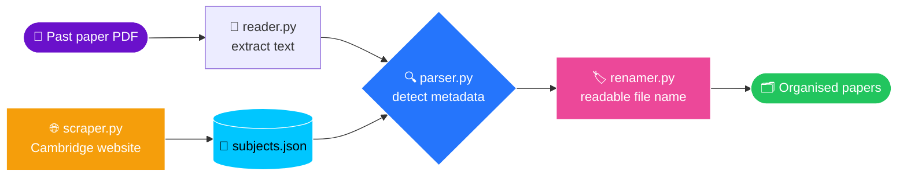

<!-- ============================== HEADER ============================== -->
<div align="center">


<a href="https://git.io/typing-svg"></a>

<br/>


</div>

---

## 🧭 Table of Contents

- [✨ About](#-about)
- [🚀 Features](#-features)
- [🗺️ How It Works](#️-how-it-works)
- [📂 Project Structure](#-project-structure)
- [⚙️ Installation](#️-installation)
- [🎮 Usage](#-usage)
- [🛣️ Roadmap](#️-roadmap)
- [🎯 What I'm Working On Next](#-what-im-working-on-next)
- [❓ FAQ](#-faq)
- [📜 License](#-license)

---

## ✨ About

> I'm building **Exam Organizer** because my past papers are a mess. Every Cambridge PDF I download has a name like `9709_w23_qp_12.pdf` or `October v13 solved.pdf`, and finding the right one before an exam takes way too long.

So I'm making a Python app that **reads any Cambridge past paper or mark scheme, figures out exactly what it is, and organises it for me**: the qualification, subject, paper, variant, session and year, straight from the PDF itself.

<table>
<tr>
<td width="33%" align="center">
<h3>📄</h3>
<b>Read</b><br/>
<sub>Extracts the text from any past paper PDF</sub>
</td>
<td width="33%" align="center">
<h3>🔍</h3>
<b>Understand</b><br/>
<sub>Detects subject, paper, variant, session and year</sub>
</td>
<td width="33%" align="center">
<h3>🗂️</h3>
<b>Organise</b><br/>
<sub>Renames and sorts your papers automatically</sub>
</td>
</tr>
</table>

---

## 🚀 Features

| Status | Feature | What it does |
|:---:|---|---|
| 🟢 | **PDF reader** (`reader.py`) | Extracts the text from every page and cleans out the dotted answer lines |
| 🟢 | **Metadata parser** (`parser.py`) | Detects QP vs MS, qualification, subject code, paper, variant, session and year |
| 🟢 | **Subject scraper** (`scraper.py`) | Pulls every subject name and code from Cambridge's website into `data/subjects.json` |
| 🟢 | **Subject names** | Looks up the subject name (e.g. `0625` → `Physics`) for every paper |
| 🟡 | **File renamer** (`renamer.py`) | Renames papers into clean, readable file names |
| ⚪ | **GUI** | A proper interface to drop papers in and see them organised |
| ⚪ | **Past-paper tracker** | Log my scores and see which topics I keep losing marks on |

<sub>🟢 Done &nbsp;•&nbsp; 🟡 In progress &nbsp;•&nbsp; ⚪ Planned</sub>

<details>
<summary><b>📊 How well does the parser work? (click to expand)</b></summary>
<br/>

I tested the parser on **400 real Cambridge papers** (200 question papers + 200 mark schemes) across 40+ subjects from **2012 to 2025**:

| Paper type | Fully correct |
|---|---|
| 📝 Question papers | **200 / 200** ✅ |
| ✅ Mark schemes | **200 / 200** ✅ |

It handles:
- 🗓️ **Old and new paper layouts** (pre-2017 and current mark scheme headers)
- 🔢 Papers **with and without** the full footer code (`0625/42/M/J/24`)
- 🌍 Every series: **Feb/March, May/June, Oct/Nov**, plus the March-only and COVID June 2020 series
- 🎓 **IGCSE, IGCSE (9–1), O Level, AS Level only, and AS & A Level**

</details>

<details>
<summary><b>📘 Extracted fields (click to expand)</b></summary>
<br/>

```python
{
    "qualification": "IGCSE",
    "subject_name":  "Physics",
    "subject_code":  "0625",
    "year":          "2024",
    "session":       "May/June",
    "paper":         "4",
    "variant":       "2",
    "paper_type":    "QP"
}
```

</details>

---

## 🗺️ How It Works



---

## 📂 Project Structure

<details>
<summary><b>🌳 View folder tree</b></summary>
<br/>

```text
Exam-Organizer/
├── 📄 README.md
├── 📄 LICENSE
├── 📄 .gitignore
├── 🐍 main.py              # Entry point (will run the app)
├── 📁 src/
│   ├── 🐍 reader.py        # Extracts and cleans the text from a PDF
│   ├── 🐍 parser.py        # Detects all the metadata from the text
│   ├── 🐍 scraper.py       # Scrapes subject names/codes from Cambridge
│   └── 🐍 renamer.py       # Renames papers using the metadata (WIP)
├── 📁 data/
│   └── 📄 subjects.json    # Generated automatically (not tracked in git)
└── 📁 test/
    └── 🐍 test.py          # Quick manual test of the whole pipeline
```

</details>

> [!NOTE]
> `data/subjects.json` is generated automatically the first time the parser runs, so you don't need to create it yourself.

---

## ⚙️ Installation

> [!IMPORTANT]
> You need **Python 3.10 or newer**.

<details open>
<summary><b>🪟 Windows</b></summary>

```bash
git clone https://github.com/Sigmaboois/exam-organizer-v3.git
cd exam-organizer-v3
python -m venv .venv
.venv\Scripts\activate
pip install pypdf requests beautifulsoup4
```

</details>

<details>
<summary><b>🍎 macOS / 🐧 Linux</b></summary>

```bash
git clone https://github.com/Sigmaboois/exam-organizer-v3.git
cd exam-organizer-v3
python3 -m venv .venv
source .venv/bin/activate
pip install pypdf requests beautifulsoup4
```

</details>

> [!TIP]
> A `requirements.txt` is coming soon, so this will become a single `pip install -r requirements.txt`.

---

## 🎮 Usage

Run everything **from the project root** so the `data/` folder is found:

```bash
py src/parser.py
```

Then paste the path to any Cambridge past paper or mark scheme:

```text
Please paste in the pdf u want to extract the metadata from:
C:\Users\me\Downloads\0625_s24_qp_42.pdf

{'qualification': 'IGCSE', 'subject_name': 'Physics', 'subject_code': '0625',
 'year': '2024', 'session': 'May/June', 'paper': '4', 'variant': '2', 'paper_type': 'QP'}
```

> [!WARNING]
> Only **question papers** and **mark schemes** are supported. Inserts, examiner reports and grade thresholds will be read as question papers.

---

## 🛣️ Roadmap

- [x] 📖 Extract text from PDFs
- [x] 🔍 Detect question paper vs mark scheme
- [x] 🎓 Detect the qualification (IGCSE, O Level, AS, AS & A Level)
- [x] 🔢 Extract subject code, paper and variant
- [x] 🗓️ Extract session and year (old and new layouts)
- [x] 🌐 Scrape every subject name from Cambridge's website
- [x] 🏷️ Look up the subject name for every paper
- [x] 🧪 Test on 400 real papers (400/400 ✅)
- [ ] 🏷️ Rename files into readable names
- [ ] 📦 `requirements.txt`
- [ ] 🩹 Handle edited/re-saved PDFs (e.g. `0` instead of `O` in the code)
- [ ] 🎨 Graphical interface
- [ ] 📊 Past-paper score tracker

---

## 🎯 What I'm Working On Next

1. **🏷️ The file renamer.** Take the metadata and turn a file like `9709_w23_qp_12.pdf` into something I can actually read at a glance, while making sure:
   - there are no characters Windows doesn't allow (like the `/` in `May/June`)
   - nothing gets overwritten if two files end up with the same name
   - files with missing metadata are skipped instead of renamed badly
2. **🌐 Fixing the scraper** so it also catches the 5 AS-only subjects that use a different link format (French, Spanish, German, Chinese and Afrikaans).
3. **📦 Adding `requirements.txt`** so setup is one command.
4. **🎨 Starting the GUI**, where warnings like "only QPs and MSs are supported" will live.

---

## ❓ FAQ

<details>
<summary><b>Which exam boards are supported?</b></summary>
<br/>
Only Cambridge (CAIE) for now: IGCSE, O Level and AS & A Level. Other boards like Pearson Edexcel use completely different formats, so they'd need their own parser.
</details>

<details>
<summary><b>Does it work on papers I've written on?</b></summary>
<br/>
Mostly, yes. But some note-taking apps re-save the PDF and change the text slightly (for example turning the letter <code>O</code> into a zero), which can break the session detection. Fixing that is on the roadmap.
</details>

<details>
<summary><b>Why do I need internet the first time?</b></summary>
<br/>
The subject names come from Cambridge's website. The first run downloads them into <code>data/subjects.json</code>, and after that everything works offline.
</details>

<details>
<summary><b>Is it free?</b></summary>
<br/>
Yes. It's open source under the MIT License. 🎉
</details>

---

## 📜 License

Distributed under the **MIT License**. See [`LICENSE`](LICENSE) for details.

<!-- ============================== FOOTER ============================== -->
<div align="center">

<br/>

**Made with ❤️ and ☕ by a student who was tired of messy past paper folders**

⭐ *If this helps you, consider giving it a star!* ⭐


</div>
