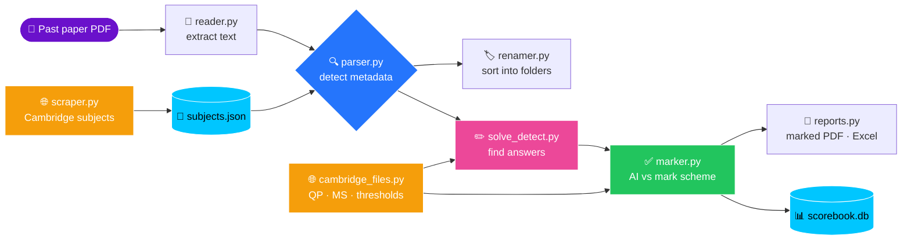

<!-- ============================== HEADER ============================== -->
<div align="center">


<a href="https://git.io/typing-svg"></a>

<br/>


</div>

---

## 🧭 Table of Contents

- [✨ About](#-about)
- [🚀 Features](#-features)
- [🗺️ How It Works](#️-how-it-works)
- [📂 Project Structure](#-project-structure)
- [⚙️ Installation](#️-installation)
- [🎮 Usage](#-usage)
- [🏗️ Building the App](#️-building-the-app)
- [🛣️ Roadmap](#️-roadmap)
- [🎯 What I'm Working On Next](#-what-im-working-on-next)
- [❓ FAQ](#-faq)
- [📜 License](#-license)

---

## ✨ About

> I started **Exam Organizer** because my past papers were a mess. Every Cambridge PDF I downloaded had a name like `9709_w23_qp_12.pdf` or `October v13 solved.pdf`, and finding the right one before an exam took way too long.

It grew into a desktop app for **teachers and students**: drop in any Cambridge past paper and it **reads it, sorts it, notices if it's been solved, and marks it against the official mark scheme**, then keeps every student's scores in one place.

<table>
<tr>
<td width="25%" align="center">
<h3>🗂️</h3>
<b>Organise</b><br/>
<sub>Detects the subject, paper, variant and series, then sorts it into tidy folders</sub>
</td>
<td width="25%" align="center">
<h3>✏️</h3>
<b>Detect</b><br/>
<sub>Spots papers that have been written on, by pen app or typed</sub>
</td>
<td width="25%" align="center">
<h3>✅</h3>
<b>Check</b><br/>
<sub>Marks every question against the official mark scheme</sub>
</td>
<td width="25%" align="center">
<h3>📊</h3>
<b>Track</b><br/>
<sub>Classes, students, scores, grades and spreadsheet export</sub>
</td>
</tr>
</table>

---

## 🚀 Features

| Status | Feature | What it does |
|:---:|---|---|
| 🟢 | **Drag & drop GUI** | A friendly desktop app (Flet). Drop single files, lots of files or whole folders |
| 🟢 | **Metadata parser** | Detects QP vs MS, qualification, subject, code, paper, variant, session and year |
| 🟢 | **Sorting** | Copies (or moves) papers into readable folders. Never overwrites, works across drives |
| 🟢 | **Solve detection** | Compares each page with Cambridge's clean original to find written answers |
| 🟢 | **AI checking** | Marks every question part against the official mark scheme, like a Cambridge examiner |
| 🟢 | **Real grades** | Turns the score into a grade using Cambridge's published thresholds for that exact paper |
| 🟢 | **Marked PDF copy** | A cover page with the score, grade and feedback, plus a marks box on each answered page |
| 🟢 | **Classes & score book** | Classes grouped automatically by qualification, students, averages and history |
| 🟢 | **Spreadsheet export** | Excel export for one class or everything |
| ⚪ | **Past-paper insights** | Which topics each student keeps losing marks on |

<sub>🟢 Done &nbsp;•&nbsp; 🟡 In progress &nbsp;•&nbsp; ⚪ Planned</sub>

<details>
<summary><b>📊 How well does it work? (click to expand)</b></summary>
<br/>

**Parser:** tested on **400 real Cambridge papers** (200 question papers + 200 mark schemes) across 40+ subjects from **2012 to 2025**:

| Paper type | Fully correct |
|---|---|
| 📝 Question papers | **200 / 200** ✅ |
| ✅ Mark schemes | **200 / 200** ✅ |

**Solve detection:** on a solved 9709 paper it found answers on exactly the 16 pages that had writing, and flagged **nothing** on clean papers.

**AI checking:** on that same solved 9709 Paper 1, the AI scored it **62/75**. I'd marked it by hand against the official mark scheme at 63/75, and the one-mark difference came down to how strictly a mark scheme note was applied. A full 20-page paper takes about 2 minutes.

</details>

<details>
<summary><b>📘 What it handles (click to expand)</b></summary>
<br/>

- 🎓 **IGCSE, IGCSE (9–1), O Level, AS Level only, and AS & A Level**
- 🗓️ **Old and new layouts** (pre-2017 and current mark scheme headers)
- 🔢 Papers **with and without** the full footer code (`0625/42/M/J/24`)
- 🌍 Every series: **Feb/March, May/June, Oct/Nov**, plus the March-only and COVID June 2020 series
- ✏️ Answers written with **any pen app** (Notability, Edge, GoodNotes…) or typed

</details>

---

## 🗺️ How It Works



---

## 📂 Project Structure

<details>
<summary><b>🌳 View folder tree</b></summary>
<br/>

```text
Exam-Organizer/
├── 📄 README.md
├── 📄 LICENSE
├── 📄 pyproject.toml          # Dependencies + build settings
├── ⚙️ build.ps1               # Builds the Windows app (see below)
├── 🐍 main.py                 # Starts the app
├── 📁 src/
│   ├── 🐍 gui.py              # Main window, side menu, settings, help
│   ├── 🐍 gui_organise.py     # "Organise" screen
│   ├── 🐍 gui_check.py        # "Check papers" screen
│   ├── 🐍 gui_classes.py      # "Classes" screen (score book)
│   ├── 🐍 gui_common.py       # Shared UI pieces (drop area, cards…)
│   ├── 🐍 app_tasks.py        # Slow jobs run in the background
│   ├── 🐍 reader.py           # Extracts and cleans the text from a PDF
│   ├── 🐍 parser.py           # Detects all the metadata from the text
│   ├── 🐍 scraper.py          # Scrapes subject names/codes from Cambridge
│   ├── 🐍 renamer.py          # Builds the folders and file names
│   ├── 🐍 organize.py         # One-file sorting pipeline
│   ├── 🐍 multi_organize.py   # Many-files sorting pipeline
│   ├── 🐍 cambridge_files.py  # Finds/downloads clean QPs, mark schemes, thresholds
│   ├── 🐍 solve_detect.py     # Spots answers written on a paper
│   ├── 🐍 marker.py           # AI marking against the mark scheme
│   ├── 🐍 reports.py          # Marked PDF copies + Excel export
│   ├── 🐍 scorebook.py        # Classes, students and results (SQLite)
│   └── 🔑 api_key.py          # Gemini key, never committed (see Installation)
└── 📁 data/                   # Generated automatically (not tracked in git)
```

</details>

---

## ⚙️ Installation

> [!IMPORTANT]
> You need **Python 3.10 or newer**.

<details open>
<summary><b>🪟 Windows</b></summary>

```bash
git clone https://github.com/Sigmaboois/exam-organizer-v3.git
cd exam-organizer-v3
py -m pip install "flet[all]==1.0.4" flet-dropzone pypdf requests beautifulsoup4 pypdfium2 pillow openpyxl
```

</details>

<details>
<summary><b>🍎 macOS / 🐧 Linux</b></summary>

```bash
git clone https://github.com/Sigmaboois/exam-organizer-v3.git
cd exam-organizer-v3
python3 -m pip install "flet[all]==1.0.4" flet-dropzone pypdf requests beautifulsoup4 pypdfium2 pillow openpyxl
```

</details>

### 🔑 AI checking key

Checking papers uses Google's **free** Gemini API.

1. Get a free key at [aistudio.google.com/apikey](https://aistudio.google.com/apikey) (Google account, no card).
2. Create `src/api_key.py` with:
   ```python
   GEMINI_API_KEY = "your key here"
   ```

> [!WARNING]
> `src/api_key.py` is git-ignored on purpose. **Never commit your key.** This repo is public, and a leaked key gets disabled.

---

## 🎮 Usage

Run it **from the project folder**:

```bash
py main.py
```

| Screen | What you do |
|---|---|
| 🗂️ **Organise** | Add papers, check what was detected, choose a destination, press **Sort**. Solved papers get a **Check it** button |
| ✅ **Check papers** | Add students' solved papers, choose whose paper each one is, press **Check**. You get the score, grade, feedback and a marked PDF |
| 👥 **Classes** | Create classes, add students, see their scores and export to Excel |

> [!NOTE]
> Drag & drop from File Explorer only works in the **built** app. When running with `py main.py`, use the **Choose files** / **Choose a folder** buttons.

---

## 🏗️ Building the App

```bash
powershell -ExecutionPolicy Bypass -File build.ps1
```

The finished app ends up in **`dist\windows\`**. Share that whole folder, and people run `exam-organizer.exe` without installing Python.

<details>
<summary><b>🛠️ What you need to build (click to expand)</b></summary>
<br/>

- **Flutter** (Flet downloads the right version the first time)
- **Visual Studio** with the **"Desktop development with C++"** workload
- **Developer Mode** turned on in Windows settings

`build.ps1` builds from a short folder (`C:\eo-build`) because Visual Studio's compiler can't handle paths longer than 260 characters, and Flutter's build folders are deeply nested.

</details>

---

## 🛣️ Roadmap

- [x] 📖 Extract text from PDFs
- [x] 🔍 Detect question papers vs mark schemes
- [x] 🎓 Detect the qualification, subject, paper, variant, session and year
- [x] 🌐 Scrape every subject name from Cambridge's website
- [x] 🧪 Test the parser on 400 real papers (400/400 ✅)
- [x] 🏷️ Sort papers into readable folders
- [x] 🎨 Drag & drop GUI with light and dark mode
- [x] ✏️ Detect solved papers
- [x] ✅ AI checking against the official mark scheme
- [x] 🏅 Grades from Cambridge's real thresholds
- [x] 📑 Marked PDF copies
- [x] 👥 Classes, students and a score book
- [x] 📊 Excel export
- [ ] 📈 Topic insights: which topics each student keeps losing marks on
- [ ] 🩹 Better support for edited/re-saved PDFs (e.g. `0` instead of `O` in the code)
- [ ] 🧾 Support for inserts, examiner reports and grade threshold files

---

## 🎯 What I'm Working On Next

1. **🧑‍🏫 Testing with real teachers.** Getting feedback on the Check papers flow and the marked PDFs.
2. **📈 Topic insights.** Grouping lost marks by topic, so a teacher can see what a class needs to revise.
3. **🩹 Re-saved PDFs.** Note-taking apps sometimes change the text slightly. The app should still recognise those papers.

---

## ❓ FAQ

<details>
<summary><b>Which exam boards are supported?</b></summary>
<br/>
Only Cambridge (CAIE) for now: IGCSE, O Level and AS & A Level. Other boards like Pearson Edexcel use completely different formats.
</details>

<details>
<summary><b>How accurate is the AI checking?</b></summary>
<br/>
On my test paper it was within one mark of careful hand-marking. It isn't perfect, though: messy handwriting can be misread. So anything it's unsure about is flagged as <b>"Double-check"</b>, and teachers should treat the marks as a very good first pass.
</details>

<details>
<summary><b>Is it free?</b></summary>
<br/>
Yes. The app is open source (MIT), and checking uses Google's free Gemini tier. Everyone using the built app shares one free daily limit; if it runs out, you can paste your own free key in <b>Settings</b>.
</details>

<details>
<summary><b>What happens to students' work?</b></summary>
<br/>
Sorting, solve detection, the score book and exports all stay on your computer. Only <b>checking</b> sends the paper's pages and the mark scheme to Google's Gemini API. On Google's free tier, Google may use that content to improve its products.
</details>

<details>
<summary><b>Where are marked copies saved?</b></summary>
<br/>
In <code>Documents\Exam Organizer\Marked\&lt;class&gt;\&lt;student&gt;\</code>. You can open the folder from <b>Settings</b>.
</details>

<details>
<summary><b>Why do I need the internet?</b></summary>
<br/>
The first launch downloads Cambridge's subject list. Checking downloads the mark scheme (if it isn't already in your sorted folders), the clean paper and the grade thresholds. Sorting itself works offline after the first launch.
</details>

---

## 📜 License

Distributed under the **MIT License**. See [`LICENSE`](LICENSE) for details.

<!-- ============================== FOOTER ============================== -->
<div align="center">

<br/>

**Made with ❤️ and ☕ by a student who was tired of messy past paper folders**

⭐ *If this helps you, consider giving it a star!* ⭐


</div>
